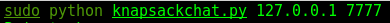
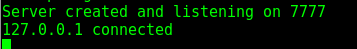

# KnapSackChat
### Python chat server using knapsack alogorithm for public key encryption.(NOT A SECURE PROGRAM)

Knap Sack chat is a proof in concept program that was developed to show a python chat server using public key crytopgraphy.

## Table of Contents
   * [KnapSackChat](#KnapSackChat)
      * [Table of Contents](#table-of-contents)
      * [Server Start](#step-1-server-start)
      * [Client Start](#step-2-client-start)
      * [Exchange Messages](#step-3-exchange-messages)

  
      
# Step 1: Server Start
Start the server by the command line by navigating to the directory where the server is insallted. You can start the server by running it with python and specifying the ip and port number. Note: This has only beenn tested locally and only on the local host. Additional configuration may be needed in order to configure on ip other than the local host.

# Step 2: Client Start
Start the client the same way as starting the server by specifiying ip and port

# Step 3: Exchange Messages
You can exchange messages back and forth with the client and the server.

